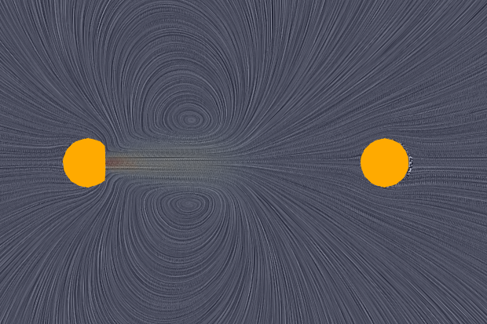
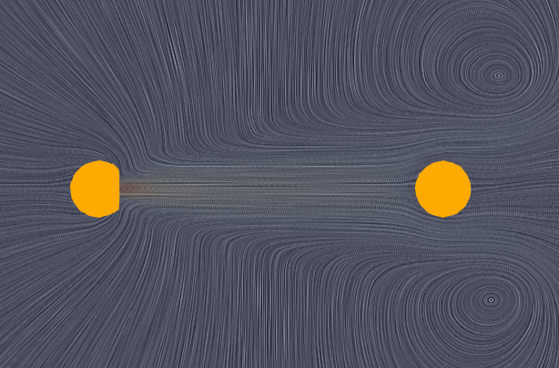
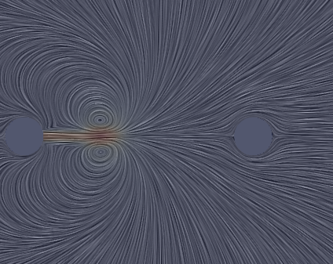

# Progress of research
## Investigation B: 3-dimensional flow
### Description of airflow
A slice of the 3-dimensional (volume) simulation is shown below that visualises air flow patterns at a) same time to the 2D case, and b) at later on in time (when the flow is generally more developed). 

  

<i>
  Images showing visualisation of instantaneous airflow patterns at differing times: (left) the same time as the 2-dimensinal simulation's visualisation, and (right) a later time in the simulation.
</i>

At the same time as the 2D simmulation the 3D airflow shows a very similar pattern to the simplified 2D case flow (see Investigation A below for more characterisation). At the later time the flow has developed to a degree where the vortices have convected downstream and around the second person's head. The jet has also changed trajectory as it approaches the second person, becoming more horizontally oriented across it's height (less divergent away from the centreline as compared to the earlier time).

#### Discussion and implications
Another similar slice perpendicular to the slice above shows a similar (axis-symmetric) pattern. Note, as this simulation is a preliminary (early) attempt, further assessment of our simulation results need to be done to ensure our results are accurate depictions of the 'real-world' flow that we are attempting to investigate.

## Investigation A: 2-dimensional flow
### Description of airflow
Simplified 2-dimensional airflow (infinitely-thin, horizontal cross-section) shows the air from the jet produced by mouth (left circle represents person speaking) travelling away and outward from centreline, reaching the second person (represented by right circle) then flowing around them. A visualisation image representing this simplified 2D flow regime is shown below.

### Discussion and implications
This represents an idealised case where the jet is oriented exactly towards person B. As this is unlikely, the flow around person B is likely to be modified (breaking the symmetry that exists in this particular case). However, even if these jet angles (away from this ideal) are significant the diverging (outward) flow pattern suggest airflow generated by the speaker would generally come into contact with the other person. 

Further, the simplification to 2-dimensions warrants investigation as 3-dimensional flow is intrinsic to turbulence, in addition to possibly 3D flow features generated by a) realistic 3D representations of people's heads and b) the flow coming out of the speaker's mouth. 
