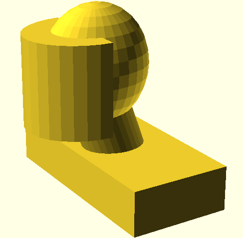

# Complex geometry meshing using _cfMesh_: combination of cell types: poly, tet, and hex.
_Published: 2024 May  
Nick Howlett, Tessellate Data Science.  

> _**Who owns the mesh, owns the solution.**_ - Dr Hrvoje Jasak, Founder of OpenFOAM.

## Introduction
_cfMesh_ is a cross-platform library for automatic mesh generation that is built on top of OpenFOAM. cfMesh is licensed under General Public License (GNU), and compatible with all recent versions of OpenFOAM [0]. 

## Cell types
cfMesh can create polyhedra cells, in addition to more standard tetradehra and hexahedra cells that are can also be created in other open-source meshing software such as [_Gmsh_](https://gmsh.info/doc/texinfo/gmsh.html). It's these polyhedra cells types in combination with cfMesh's flexible geometry representation that we believe can allow it to achieve a 'good' quality mesh (see below for evidence).

## Our geometry
We required meshing for a complex geometry involving a rectangle (extruded) domain (outer) with internal volumes including curved surface in combination with ellipsoid, cylinder, and rectangular cuboid subtracted from that outer domain (see image below).

  

## Our meshing process
Prior to using cfMesh, we represented this geometry using Gmsh then attempted to mesh it using a combination of tet & hex cells. We varied numerous dimensional parameters using an iterative method (parameter sweep) attempting to find a sufficent-quality mesh, but were unable to achieve an 'OK' mesh (we used OpenFOAM's `checkMesh` results as our quality metric to evaluate differing meshing schemes).

## cfMesh features
Conversely we found cfMesh was able to adequately mesh the same input geometry relative easy. We believe this is due to:
- cfMesh's approach of degrading the geometry to achieve good meshing results (using an STL file as input [1]).
- cfMesh's combined use of poly, tet, and hex cells in a single mesh (e.g. when using 'cartesianMesh' module).

In this particular flow scenario, we believe the degredation of our geometry would not impact the flow dynamics, with additional shape contraints (via `surfaceFeatureEdges`) only slightly improving the resolution of the geometry representation and thus the qualitative fluid dynamics (a priori).

Interestingly we also found meshes were non-deterministic for same mesh parameters, hence their respective quality results differed (which has also been [seen elsewhere](https://www.cfd-online.com/Forums/openfoam-community-contributions/198872-general-workflow-create-flawless-mesh-cfmesh.html)), although we suspect previous parameter-dependent behaviour. Additonally we found the `improveMeshQuality` utility's improvements hit-or-miss, which appeared random.

## Meshing tutorial
We now guide the reader thru meshing the complex geometry, described above, using cfMesh. cfMesh is available in-built with _OpenFOAM 2312_ so you're advised to install that version. _OpenSCAD_ (also open-source) is also needed for the geometry creation so install the command-line version. Then download [related files](https://github.com/TessellateDataScience/faceShieldOptimisations/tree/main/foamCases/3D_LES_particles/partShield).

### Meshing: STL vs FMS
cfMesh allows retaining particular edges (features) of the geometry via it's `surfaceFeatureEdges` utility which converts an STL file to FMS format. This utility enforces this features (making them contraints on the subsequent meshing process), which we found much computationally harder than meshing the original STL file. Meshing the STL file caused the geometry to be degraded, which could potentially change the fluid dynamics. Another tip is to visually inspect the mesh (such as using ParaView) to ensure the geometry isn't corroded significantly. 

### Mesh quality: `checkMesh` 
OpenFOAM's `checkMesh` utility allows you to assess the mesh quality: 
- Geometry errors must be removed (checkMesh will report 'Mesh OK.' if solvable).
- Can solve (run) with mesh quality issues such as skewness, aspect ratio, and non-orthogonality:
	- May lead to solver instability (i.e. divergence), and if not give significantly erroneous results [2].

### Feature meshing
If you need features by using cfMesh's `surfaceFeatureEdges` (then meshing the FMS file): 
- Overall mesh quality required iteration of size parameters. cfMesh's `cartesianMesh` [4] gave us an OK mesh, but only when using **very** particular parameters. Some notable aspects include:
	- mesh size changes of relatively small magnitude (delta = 0.005 mm) caused 'negative-volumed cells' to vary.
	- beyond a range of acceptable values, the number of 'bad' cells increased very significantly (we assume qualitative changes in the mesh topology are the cause).
- cell's non-orthoganality (~ 80 degrees for the worst cells) required us to modify 'fvSolution' to increase number of corrector loops [3] to maintain solver stability.

## Footnotes
[0] For more details of cfMesh please consult [cfMesh's official user guide](https://cfmesh.com/wp-content/uploads/2015/09/User_Guide-cfMesh_v1.1.pdf).  
[1] Meshing the FMS file caused the cfMesh's algorithm to have a harder time enforcing these constraints, resulting in poorer _checkMesh_ results.  
[2] [Advanced meshing using OpenFOAM technology cfMesh: Mesh quality assessment in CFD: Checking mesh quality in OpenFOAM](https://www.wolfdynamics.com/training/CFMESH/cfmesh2017.pdf)  
[3] [CFD Online: Running high non orthogonality mesh: Thanks to Kuzey Can Derman](https://www.cfd-online.com/Forums/openfoam-solving/249271-running-high-non-orthogonality-mesh.html)  
[4] cfMesh's _cartesianMesh_ is hexahedra dominant, but will also introduce tetrahedra & polyhedra cells as required.  