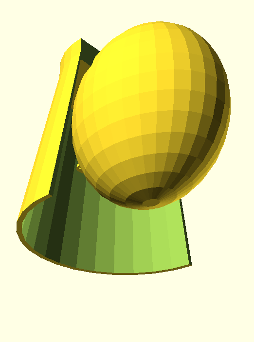
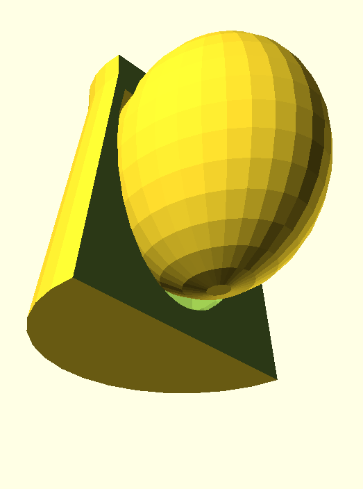

# Getting started with computational modelling of speech-driven airflow between two people
We've developed a 'turnkey' application (software) that allows anyone with a computer to do some _fluid dynamics_ research in an accessible way, without being a _computational science_ expert from the start. 

## Motivation: is their life good enough?
_Do you value that everyone have access to healthcare as easily as we do in Western countries?_
 - You can do computational-based research to advance this cause (without the credentialism [0]):
   - Less impact on your ability to go to other 'work'.
   - Flexibility to research when you're more in your _flow_ state.
   - Ability to complement R&D with other more provocative endeavours [1].

We have the younger generation in mind, including secondary & university students, but we realise everyone can decide what's important to them at any age & stage.

## Getting started
Start the Docker Desktop app [2] and start the Terminal app [3], then copy/paste each line that follows to the 'terminal' then hit Enter (i.e. execute that 'command'). The following only needs to be done once to create the directory:
```
mkdir foamDockEnv
cd ./foamDockEnv
``` 

You're now able to launch computational investigations via the freely-available OpenFOAM software. First launch then load our pre-configured environment by executing:
```
docker run -it --mount "type=bind,src=$pwd,target=/home/foam" nchowlett/foam-tds:U22.1.16 sh
su foam
. /opt/openfoam12/etc/bashrc
cd ..
ipython
```
You'll need to get `caseInput.py` from our [online repository](https://github.com/TessellateDataScience/faceShieldOptimisations/tree/main/getStarted) and save it in the `./foamDockEnv` directory. Then make a copy of OpenFOAM's case (input) directory to ensure reproducibility via `cp -r /home/foamFiles/combined /home/foam/caseRun`. This `caseRun` directory should now be viewable, and moreover modifiable without risk of messing up the computations more permanently, within your `foamDockEnv` directory.

## Run a computation
Conduct a test computation by executing `%run ./caseInput.py`, during which you'll get an estimate of the computation's time-to-completed. After the computation is complete you can stop our computational environment by executing `exit` then `exit` again. Nice work, you've entered the digital realm of _computational fluid dynamics_!

Before you get carried away with excitement, realise you've simulated 1.0 seconds of the fluid dynamics, yet to have an adequate picture of what's happening overall for our scenario you'll probably need to simulate T ~ 45 [secs]. To increase the time simulated modify `caseInput.py`, changing the `endTime` parameter to	= 45.0. If you have less than 4 cores available in your CPU you can change the number to be allocated to each computation via modifying `numbCores`. Save the file then run the computation. 

Note the **full computation will take days to complete**, so we recommend you disable hibernatation of your computer while running a computation. In the mean time perhaps check out a [whirlwind introduction to computational fluid dynamics](https://www.youtube.com/watch?v=EYPH6ef3dDA). We're using OpenFOAM as our CFD software, so after the video maybe skim this software's [user guide which introduces the main inputs into the computation](https://doc.cfd.direct/openfoam/user-guide-v13/cases) for an overview of what aspects can be varied. We're thinking this will mostly be focussed on if you have problems running a computation successfully (your computation has _convergence_ problems before your total simulation time has been reached, in other words).

## Novel face-shield design
The computation above simulates flow around a conventional face shield (labelled 'normal'). We've also provided a novel design where surfaces cover the bottom and sides, with a gap near the wearer's face (labelled 'enclosed'). Relevant differences between these designs are shown below:

  
<p align="center"><i>
  Computer-aided design representation of 2 differing face-shield designs: 'normal' is a commercially-available product (left), while 'enclosed' is a proposed innovative product (right). Both actual designs are thinner than they are represented by this CAD (with a real thickness similar to currently-available face-shields).
</i></p>

To run identical computations across these differing designs (effectively a perfect _randomised trial_), you first need to enable the enclosed face-shield design 'geometry' data then remesh this geometry: 
```
cd ../../foamFiles  
git checkout enclosed
cd ./combined
. /opt/openfoam12/etc/bashrc
bash caseSetup.sh
```

Let the environment remesh, and if all is well you'll see 'Mesh OK' after you execute `checkMesh`. Save your previous 'caseRun' as another name, then copy the 'enclosed' case to your working directory via the same command as before. Finally run a computation of airflow around the novel shield.

## Analysis of designs
To conduct analysis of the computational results it's easier if you use another more-dedicated 'post-processing' environment. To enable this [Jupyter](https://jupyter.org/) environment, exit the computational env. then execute `docker run -it -v "$(pwd):/home/jovyan/work" -p 8888:8888 ghcr.io/pyvista/pyvista:latest`. Once the environment is loaded, copy then paste the URL (similar to 'http://127.0.0.1:8888/lab?token=139...') into your web browser (Chrome, Firefox, etc). 

Select 'Python' under 'Notebook', then click on the `work` directory (on left side). To run our analysis on your computations, download `dataAnalysis.ipynb` into your 'working' directory (`foamDockEnv`) then open that notebook (visible within `work` directory). Run that notebook using the 'double play' button. You show see bioaerosols' trajectories appear below the last 'cell'. If you get an error (shown in red), you will probably have to change the 'path' to your case data, or comment out some lines in each `0/*` file via `//#includeEtc "caseDicts/setConstraintTypes"`.

## Co-designing of research
As an aside, we're leveraging a server with loads of cores to run numerous computations simultaneously, with intention to increase confidence (reliability) such investigations, like yours above, are adequately accurate. But, you might want to explore a recommended OpenFOAM reference [4] to more fully understand what is computing under-the-hood, if you're interested in further investigations of the fluid dynamics & changing PPE designs.

## Footnotes
[0] Saving you 3+ years of time due to not having to complete usually non-essential 'requirements' as part of research degree prerequisites).  
[1] Coursera | What Is Social Entrepreneurship? A Guide: https://www.coursera.org/articles/social-entrepreneurship  
[2] Docker | Installation: https://docs.docker.com/get-started/get-docker/  
[3] Terminal | Installation: https://learn.microsoft.com/en-us/windows/terminal/install  
[4] OpenFOAM Technology Primer: http://dx.doi.org/10.13140/2.1.2532.9600  
